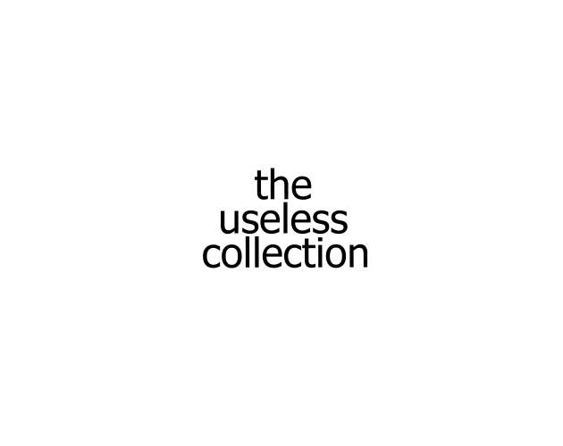

 
A collection of software that serve no purpose other than waste your time. Forking is encouraged!

Requires Python 3.9 for building.

## Usage
Run the EXEs lol

## Building
Download or clone the repo, go into any folder and run build.bat. To use on Unix-based systems run "pyinstaller main.py --onefile" on the command line in any of the folders. You can also use the executables in the <code>automated-build/</code> folder to build all the programs at once.
